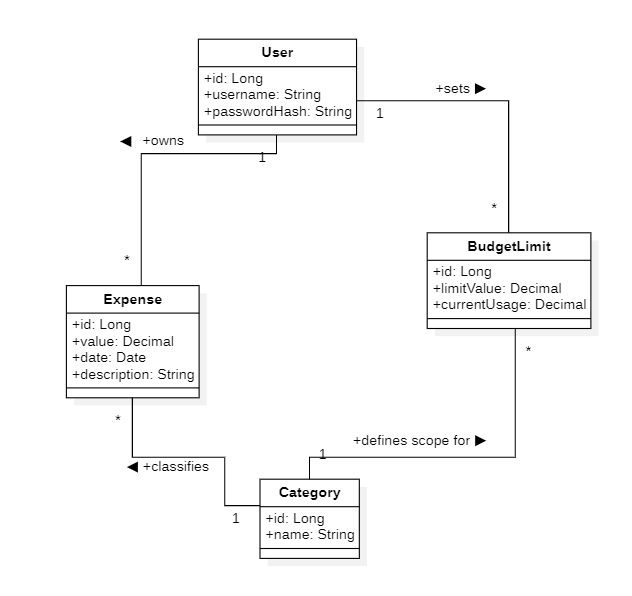

# Conceptual Domain Model

The conceptual model represents the essential data entities within the **Budget Insight System (BIS)** and the logical relationships between them. This model serves as the foundation for the **Object-Relational Mapping (ORM)** implementation.

---

### 🏛️ Entity Descriptions

| Class | Description | Key Attributes |
| :--- | :--- | :--- |
| **User** | Represents an authenticated individual in the system. | `username`, `passwordHash` |
| **Expense** | An individual financial transaction record. | `value`, `date`, `category` |
| **Category** | A label used to group related expenses for reporting. | `name` |
| **BudgetLimit** | A user-defined threshold for a specific category. | `limitValue`, `currentUsage` |

---

### 🔗 Logic & Relationships

* **User → Expense (1:N)**: Each expense is strictly owned by a single user to ensure data isolation.
* **Category → Expense (1:N)**: Categories are used to classify spending records for the **F5: Expenses Categorization** feature.
* **User/Category → BudgetLimit**: This relationship enforces the **F6: Categories Budgeting** rules. A user sets a specific limit for a category, which the system monitors in real-time.
* **Integrity Enforcement**: The Business Layer utilizes these relationships to calculate whether a "Limit Reached Warning" should be triggered during an **Add Expense** operation.

---

### 🛠️ Technical Implementation
As required by the project constraints, these classes are implemented using an **ORM framework**, mapping these conceptual entities directly to relational database tables. The **Layered Architecture** ensures that the Business Layer handles the logic between these entities while the Data Layer handles their persistence.