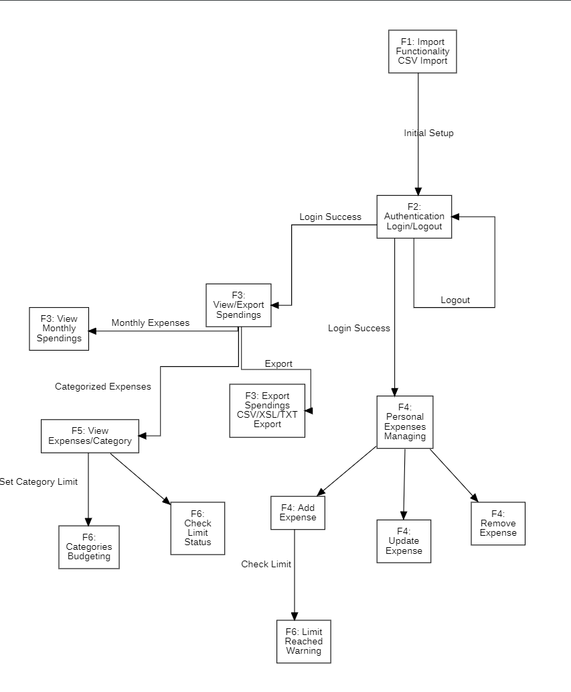

# Feature Flow Diagram

This diagram represents the operational logic and state transitions within the **Budget Insight System (BIS)**. It tracks the user journey from data entry to real-time budget monitoring.

---

### 📊 Diagram Legend

| Element | Description |
| :--- | :--- |
| **F1: Import Functionality** | The entry point for the system where all user and spending data is batch-imported via CSV. |
| **F2: Authentication** | The gateway for users to access personal data; includes Login Success and Logout flows. |
| **F3: View/Export** | Allows users to generate monthly reports and choose to export them in CSV, XSL, or TXT formats. |
| **F4: Managing** | The core CRUD module where users can add, update, or remove personal expenses. |
| **F5: Categorization** | A specialized view for analyzing spending based on user-defined or imported categories. |
| **F6: Budgeting** | The logic layer that tracks spending against limits and triggers a "Limit Reached Warning". |
| **Solid Arrows** | Represent the sequential flow of control between system modules. |
| **Labels (e.g., "Check Limit")** | Specific triggers or conditions required to advance to the next system state. |