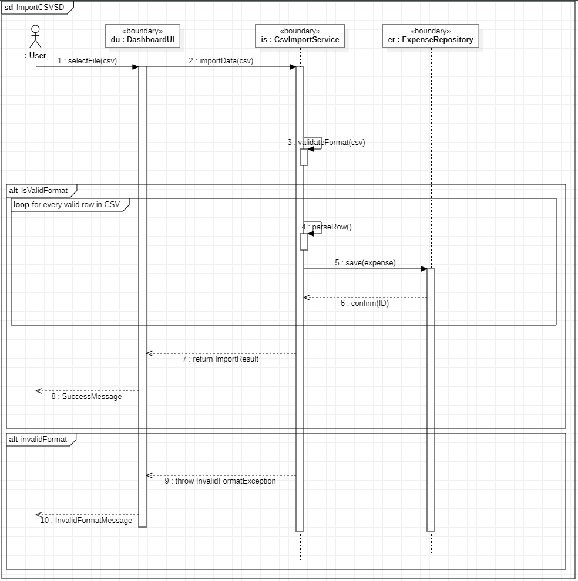

# Sequence Diagram: ImportCSVSD

## Participants
| Name | Type | Description |
| :--- | :--- | :--- |
| **User** | Actor | The end-user initiating the file upload. |
| **du : DashboardUI** | «boundary» | The front-end interface. |
| **is : CsvImportService** | «boundary» | The logic layer that validates and parses the file. |
| **er : ExpenseRepository** | «boundary» | The data layer responsible for persistence. |

## Workflow Steps

1. **User** calls `selectFile(csv)` on **DashboardUI**.
2. **DashboardUI** calls `importData(csv)` on **CsvImportService**.
3. **CsvImportService** executes internal call `validateFormat(csv)`.

### Alternative Flow: [IsValidFormat]
* **Loop**: for every valid row in CSV
    * **CsvImportService** executes internal call `parseRow()`.
    * **CsvImportService** calls `save(expense)` on **ExpenseRepository**.
    * **ExpenseRepository** returns `confirm(ID)` to **CsvImportService**.
* **CsvImportService** returns `ImportResult` to **DashboardUI**.
* **DashboardUI** displays `SuccessMessage` to **User**.

### Alternative Flow: [invalidFormat]
* **CsvImportService** sends `throw InvalidFormatException` to **DashboardUI**.
* **DashboardUI** displays `InvalidFormatMessage` to **User**.