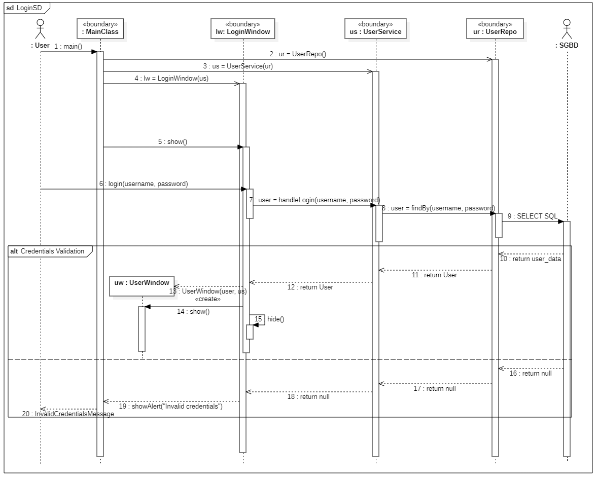

# Login Sequence Diagram

## Overview
This sequence diagram illustrates the step-by-step process of user authentication within the application. It captures the initialization of the core application components and the conditional logic for both successful and failed login attempts.

## Participating Components (Lifelines)
* **User (Actor):** The person interacting with the application.
* **MainClass:** The application's entry point, responsible for instantiating the core services and initial UI.
* **LoginWindow (Boundary):** The user interface where credentials are submitted.
* **UserService (Control):** The business logic layer that handles the authentication process.
* **UserRepo (Entity/Repository):** The data access layer responsible for database queries.
* **SGBD (Actor/Database):** The external Database Management System.
* **UserWindow (Boundary):** The main application dashboard displayed upon successful login.

> **Note on Component Lifetimes:** `UserService`, `UserRepo`, and `LoginWindow` are instantiated by `MainClass` at application startup. Their lifelines persist throughout the entire runtime of the application, which is why they are positioned at the top of the diagram alongside the actors.

## Initialization Phase
1. `MainClass` starts execution via `main()`.
2. `MainClass` initializes the `UserRepo` (`ur = UserRepo()`).
3. `MainClass` initializes the `UserService`, injecting the repository (`us = UserService(ur)`).
4. `MainClass` initializes the `LoginWindow`, injecting the service (`lw = LoginWindow(us)`).
5. `MainClass` calls `show()` on the `LoginWindow` to display it to the user.

## Interaction Flow
1. The **User** enters their credentials and triggers `login(username, password)` on the `LoginWindow`.
2. `LoginWindow` delegates the request by calling `handleLogin(username, password)` on `UserService`.
3. `UserService` requests data by calling `findBy(username, password)` on `UserRepo`.
4. `UserRepo` sends a `SELECT SQL` query to the **SGBD**.

## Alternative Flows (`alt` block)

The system handles the database response using an `alt` combined fragment based on the validity of the credentials:

### Path A: [Valid Credentials]
* **SGBD** returns the requested user record to `UserRepo`.
* `UserRepo` maps the data and returns a valid `User` object to `UserService`.
* `UserService` returns the `User` object to the `LoginWindow`.
* `LoginWindow` instantiates the `UserWindow` (`uw = UserWindow(user, us)`).
* `LoginWindow` calls `show()` on the `UserWindow`.
* `LoginWindow` calls `hide()` on itself to remove the login screen from view.

### Path B: [Invalid Credentials]
* **SGBD** returns an empty result (no match found).
* `UserRepo` returns `null` (or an error state) to `UserService`.
* `UserService` returns `null` to `LoginWindow`.
* `LoginWindow` triggers a self-message (e.g., `showError("Invalid credentials")`) to notify the user. The window remains open, allowing the user to try again.