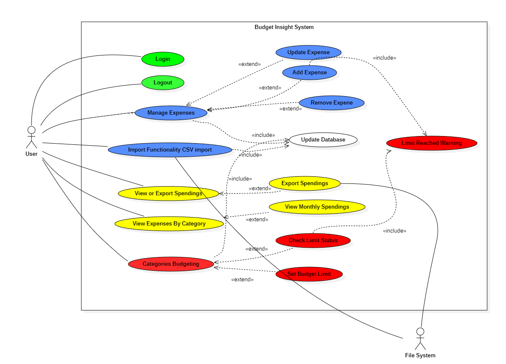

# Use Case Diagram

The Use Case diagram defines the functional scope of the system and the interactions between external actors and the internal system boundaries.

---

### 📊 UML Element Legend

| Element | Role in BIS Project |
| :--- | :--- |
| **Primary Actor (User)** | The individual who interacts directly with the system to manage their personal budget. |
| **Secondary Actor (File System)** | An external entity that facilitates the physical storage and retrieval of CSV/XSL/TXT files. |
| **System Boundary (Box)** | Represents the limits of the **Budget Insight System**; only use cases inside this box are part of the application scope. |
| **Use Case (Oval)** | A specific goal or function, such as **UC-4: Manage Personal Expenses**. |
| **Association (Solid Line)** | Indicates a direct interaction or communication path between an actor and a use case. |
| **`<<include>>` (Dashed Arrow)** | A mandatory relationship where one use case is required for the completion of another (e.g., Add Expense *includes* Update Database). |
| **`<<extend>>` (Dashed Arrow)** | An optional relationship indicating a path that only occurs under specific conditions (e.g., Export *extends* View Spending). |