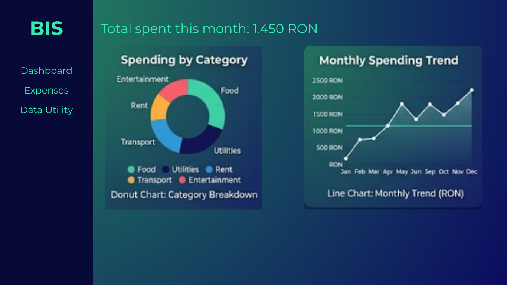
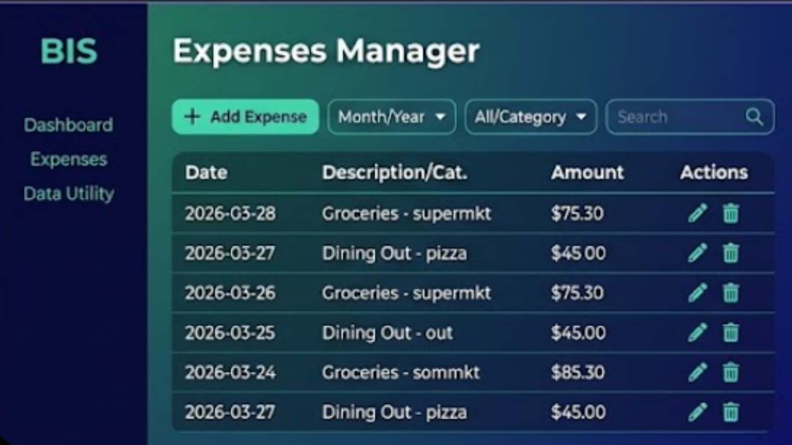
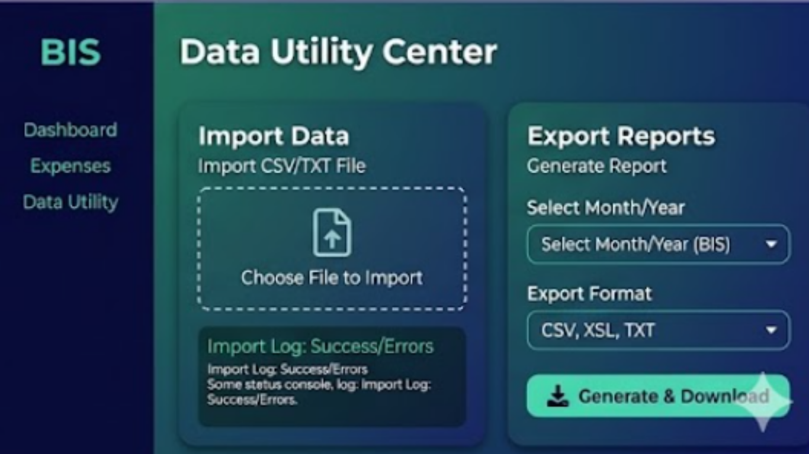

# GUI Prototype: Budget Insight System (BIS)

This prototype represents the **Presentation Layer** of the system. The design focuses on a modern "Dark Mode" aesthetic using the **Montserrat** typeface for high readability and a professional financial feel.

---

## 🖥️ Dashboard View (F3, F5, F6)
The dashboard provides a high-level summary of the user's financial health.

* **Real-time Monitoring**: The progress bars turn red to trigger the **F6: Limit Reached Warning**.
* **Visual Categorization**: The donut chart provides a breakdown of spending for **F5**.

---

## 📝 Expense Manager (F4)
This view handles the core CRUD operations for individual spending records.

* **Functional Logic**: Users can add, edit, or remove expenses.
* **Architecture Note**: This view interacts with the `ExpenseService` in the Business Layer.

---

## 📥 Data Utility Center (F1, F3)
This fulfills the requirement of managing data through file-based batch operations.

* **Batch Import (F1)**: Dedicated zone for CSV/TXT file processing.
* **Flexible Export (F3)**: Options for CSV, XSL, and TXT report generation.